  

  

  
  
  
  
  
  

## 📌 About This Project

This project is a **vision-based line follower car** built using a **Raspberry Pi**, **Pi Camera**, and an **MPU6050 gyroscope**.  
Instead of using traditional IR sensors, the robot detects and follows a black line using **OpenCV image processing**.

The Raspberry Pi captures camera frames, extracts the line position from the image, and calculates an error value.  
This error is passed through a **PID control algorithm** to adjust the speed of two DC motors using a **TB6612FNG motor driver**.

An **MPU6050 gyro** is used to measure angular motion, helping the robot stay stable and perform sharp turns at higher speeds.  
The Raspberry Pi is powered only by a **USB power bank**, while the motors use a separate power source to ensure reliability.

This project is designed to be **simple, fast, and educational**, making it ideal for beginners who want to learn **robotics, computer vision, and real-time control systems** using Raspberry Pi.

```mermaid
flowchart LR
A[Camera 📷] -->|Frames| B(OpenCV 👁️)
B --> C{Line Error}
C --> D[PID Controller ⚙️]
D --> E[Motor Driver 🔌]
E --> F[Motors 🛞]
C --> G[MPU6050 🧭]
G --> D
```

